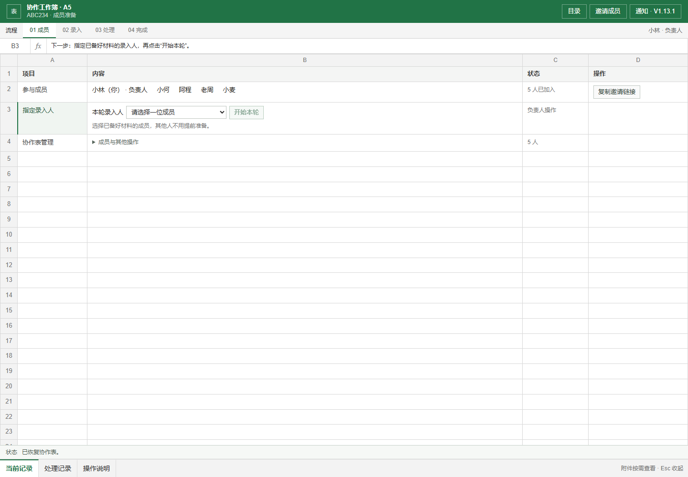
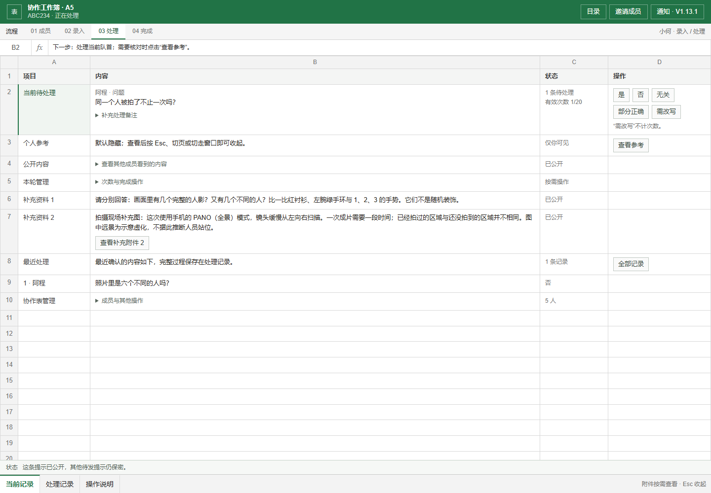
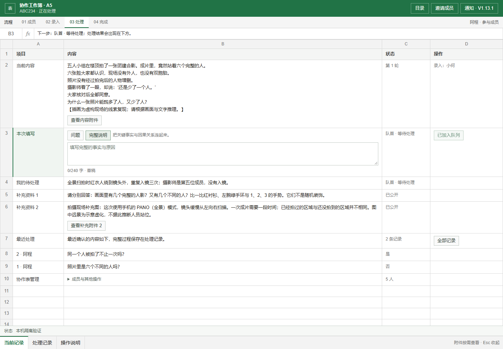
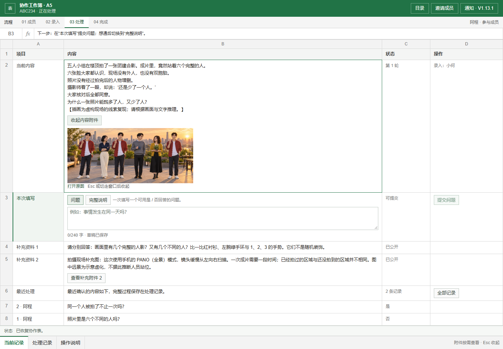
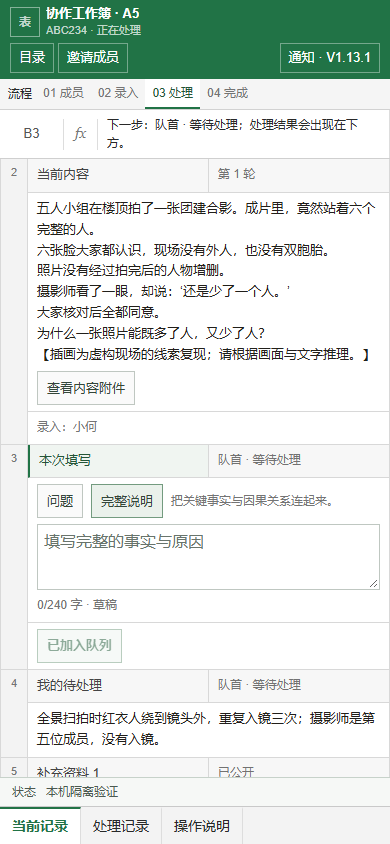

# A5 V1.13.1：指定汤主与低干扰工作表

2026-09-30。V1.13 的指定汤主规则继续保留；根据用户对卡片预览的反馈，V1.13.1 恢复工作表外观。本次只更新前端与说明，不增加数据库迁移。

## 界面约束

低调的工作表外观是本项目的前提。新手引导通过当前行、公式栏和简短操作说明实现：不使用大标题、卡片、大面积绿色按钮或庆祝文案。保持列字母、行号、灰色表头、单元格边框和紧凑字号。

默认页用“录入人、当前记录、待处理、参考资料”等中性标签。需要了解玩法时，打开“操作说明”查看与汤主、谜面、完整还原等概念的对应关系。素材正文仍按原样显示。

图片默认不请求、不展开。点击后在单元格内以最大 360px 宽、220px 高的附件显示，公开图可另开原图；Esc、切页、窗口失焦或切后台后收起。私密参考资料仍默认隐藏。

## 当前操作流程

1. **成员**：已有编号的成员选择“加入协作表”；组织者先“新建协作表”，再发邀请。至少两人到齐后，负责人在“本轮录入人”中指定汤主，点击“开始本轮”。没有默认人选或随机分配。
2. **录入**：汤主选择“导入材料”或“手动填写”。公开内容是谜面，参考结论是完整答案；后者保持私密。检查后点击“发布内容”，其他成员自动进入填写阶段。
3. **处理**：其他成员在“本次填写”选择“问题 / 完整说明”，分别保存两份草稿。提交后显示自己的待处理内容与队列位置。汤主在“当前待处理”行回答队首；“查看参考”可展开答案和待发提示，再逐条公开补充资料。
4. **完成**：完整说明判定“通过并完成”后公开参考结论，可按需查看结论附件。负责人再次指定录入人，允许同一人连续出题。

“当前记录 / 处理记录 / 操作说明”三个页签保留。手机上同一条记录按行号纵向排列，不使用卡片，也无需横向寻找操作。

## 当前预览

以下截图来自真实 React 组件和本地五人模拟房间，不代表在线站点已部署。旧 `v13-*.png` 仅保留为历史预览。

## 发布

用户已在当前任务中回传 V13 的 7 项只读核验结果，全部为 `true`。该环境升级本版只需发布 `test` 分支的前端，成员随后刷新页面；无需重跑 SQL。本轮没有执行云端写操作，也没有触发部署。

尚未安装 V13 的其他环境，仍需先执行 [指定汤主增量 SQL](../cloudbase/concurrency-v13-soup-designated-host.sql)，再运行 [只读核验 SQL](../cloudbase/verify-v13-soup-designated-host.sql)，确认 7 行通过后发布前端。前置依赖及私有图片存储与 V1.13 一致。

## 验证

- `npm test`：148 项回归通过，包含现有 SQL、隐私、独立草稿、材料解析与实际组件渲染测试；入口渲染检查增加无卡片、大标题及显眼玩法词的约束。
- `npm run lint`、`npm run build` 通过；构建包含 TypeScript 检查。
- Edge headless：18 项本地实际 React 流程检查通过。包含指定另一人、导入三张图、处理队首、刷新恢复提示、隐私收起、两份草稿、过期响应保留文字、队列状态、完成、连续同人和手动录入；补充验证默认工作表无大标题/卡片，以及公开附件尺寸与 Esc/失焦收起。桌面与 390px 手机截图已目视检查，无横向溢出与浏览器运行时错误。见 [检查记录](soup-v13/quiet-browser-checks.json)。
- 界面测试使用本地云接口替身，未连接真实 CloudBase。用户的 SQL 核验是独立提供的云端证据；真实多浏览器同步、上传和真人趣味性仍由上线试玩确认。

发布后的最短验收：两人分别建房、加入；负责人指定另一人为录入人；对方发布内容，负责人提交问题，录入人处理并完成；下一轮继续指定同一人。打开一张图片后按 Esc 或切走窗口，确认图片收起。
