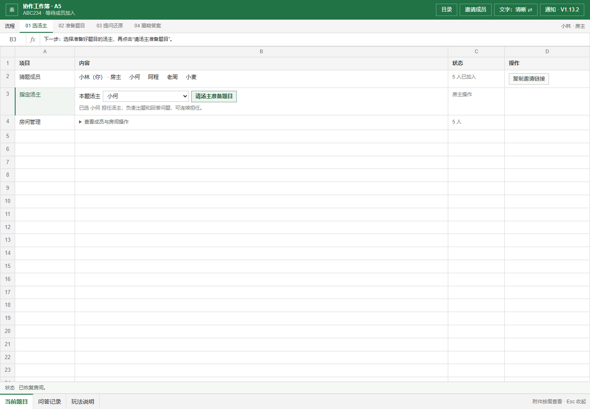
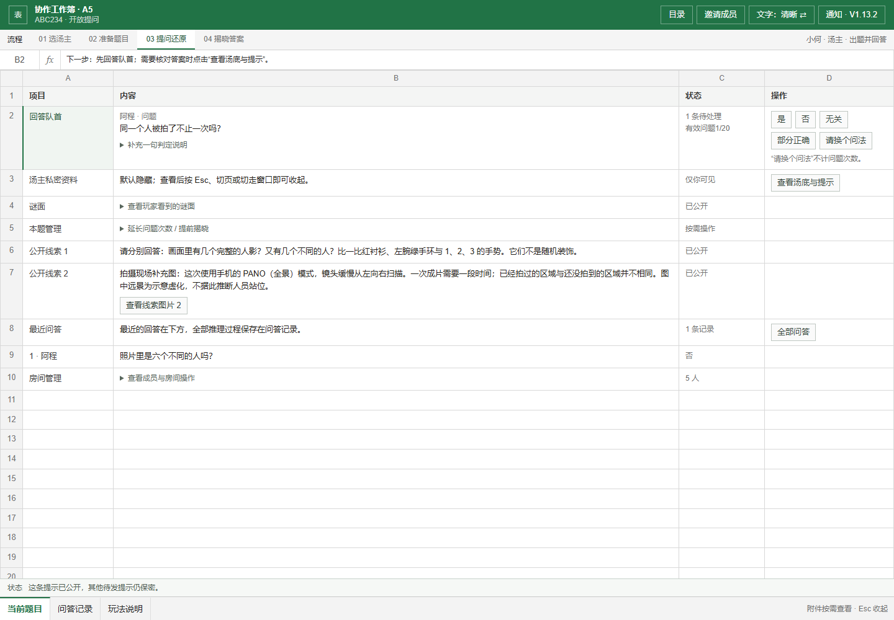
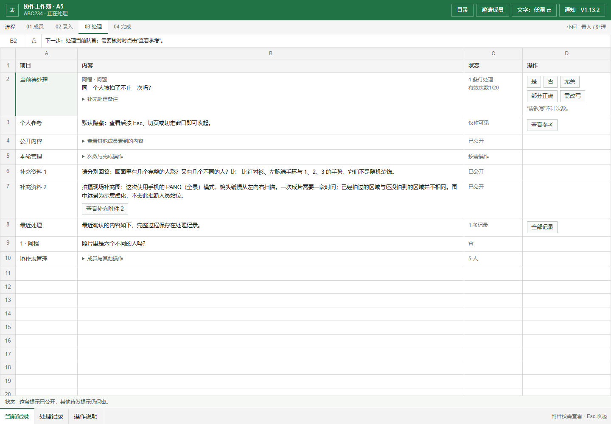
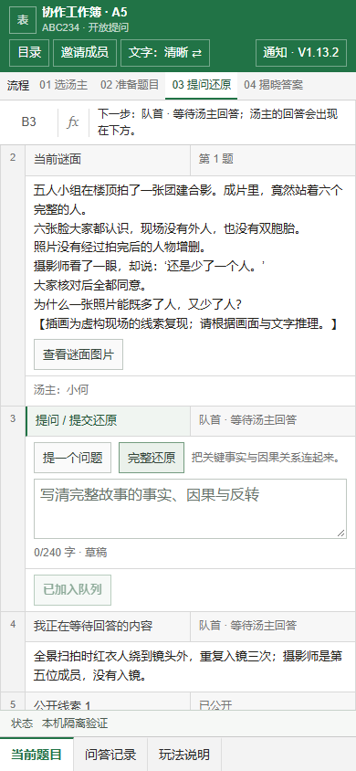

# A5 V1.13.2：清晰 / 低调文字切换

2026-09-30。标题栏新增“文字：清晰 ⇄ / 文字：低调 ⇄”按钮。首次使用默认清晰文字，选择后保存在当前浏览器；刷新会恢复。两种模式共用紧凑工作表，只改变界面措辞。

## 显示方式

外观继续保留行号、列字母、灰色表头、单元格边框和小按钮。新手直接阅读清晰文字，熟悉流程后可切换为低调文字。

| 操作 | 清晰文字 | 低调文字 |
| --- | --- | --- |
| 指定出题人 | 本题汤主 | 本轮录入人 |
| 准备题目 | 导入题材包 / 手动出题 | 导入材料 / 手动填写 |
| 向其他成员公开题目 | 发布谜面，开始提问 | 发布内容 |
| 提交完整解答 | 提交还原 | 提交说明 |
| 查阅私密答案 | 查看汤底与提示 | 查看参考 |
| 判定成功 | 还原成功，揭晓答案 | 通过并完成 |
| 页签 | 当前题目 / 问答记录 / 玩法说明 | 当前记录 / 处理记录 / 操作说明 |

按钮、流程、提示语与说明页一起切换。切换不发送房间操作，不改变汤主人选、题目、答案、当前填写类型或草稿，也不改变其他成员的显示选择。题目正文、玩家提交内容与姓名按原样显示。

选择按浏览器保存，同一浏览器的同源标签页同步选择；不同设备各自设置。如果浏览器禁用本地保存，切换仍在当前页面生效，刷新后不保证保留。读取偏好前的静态页面使用低调文字，避免已选择低调的用户刷新时先闪出清晰措辞。

图片默认不请求、不展开。点击后在单元格内以最大 360px 宽、220px 高的附件显示，公开图可另开原图；Esc、切页、窗口失焦或切后台后收起。私密答案仍默认隐藏。

## 当前操作流程（清晰文字）

1. 成员选择“加入房间”；组织者先“创建房间”，再发邀请。至少两人到齐后，房主在“本题汤主”指定一人，点击“请汤主准备题目”。没有默认人选或随机分配。
2. 汤主选择“导入题材包”或“手动出题”，检查谜面与完整汤底，再点“发布谜面，开始提问”。汤底保持私密。
3. 其他人在“提问 / 提交还原”选择“提一个问题”或“完整还原”，两份草稿分别保存。提交后显示排队位置。汤主直接在“回答队首”处理；“查看汤底与提示”可查看私密答案，并按需要逐条发布提示。
4. 判定“还原成功，揭晓答案”后公开完整汤底，可按需查看结局图片。房主再次指定汤主，允许同一人连续出题。

手机上同一条记录按行号纵向排列，两种文字均无需横向寻找操作，切换按钮位于标题栏。

## 当前预览

以下截图来自真实 React 组件和本地五人模拟房间，不代表在线站点已部署。旧 `v13-*.png` 与 `quiet-*.png` 保留为历史预览。

## 发布

用户已在当前任务中回传 V13 的 7 项只读核验结果，全部为 `true`。该环境升级本版只需发布 `test` 分支的前端，成员随后刷新页面；无需重跑 SQL。本轮没有执行云端写操作，也没有触发部署。

尚未安装 V13 的其他环境，仍需先执行 [指定汤主增量 SQL](../cloudbase/concurrency-v13-soup-designated-host.sql)，再运行 [只读核验 SQL](../cloudbase/verify-v13-soup-designated-host.sql)。前置依赖及私有图片存储与 V1.13 一致。

## 验证

- `npm test`：148 项回归通过，覆盖 SQL、隐私、独立草稿、材料解析及实际组件渲染；静态入口继续使用低调文字。
- `npm run lint`、`npm run build` 通过；生产构建包含 TypeScript 检查。
- Edge headless：29 项本地实际 React 流程检查通过。覆盖首次默认、偏好恢复、不同浏览器各自选择、无法保存偏好时仍能切换，以及切换时保留汤主人选、导入材料、手动题目、两份草稿、填写类型和确认状态；同时回归指定汤主、三图导入、隐私收起、队列判定、过期响应、揭晓及连续同人出题。见 [检查记录](soup-v13/wording-browser-checks.json)。
- 两种文字的桌面与 390px 手机页面均无横向溢出，浏览器无运行时错误，截图已目视检查。
- 界面检查使用本地云接口替身，未连接真实 CloudBase。用户的 SQL 核验是独立提供的云端证据；真实多浏览器同步、上传和真人趣味性仍需上线试玩确认。

发布后的最短验收：新浏览器应显示清晰文字，切换低调并刷新应保留选择；两人建房并指定汤主，导入或手动出题；填写过程中来回切换文字，确认输入保留；回答并揭晓后继续指定同一人。打开图片后按 Esc 或切走窗口，确认收起。
