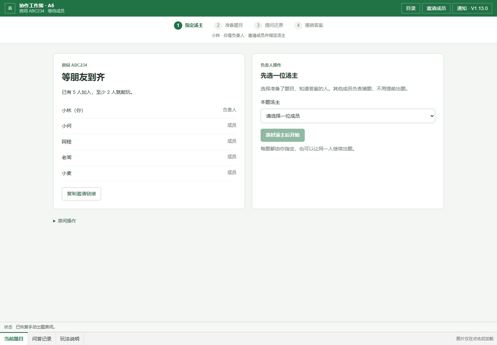
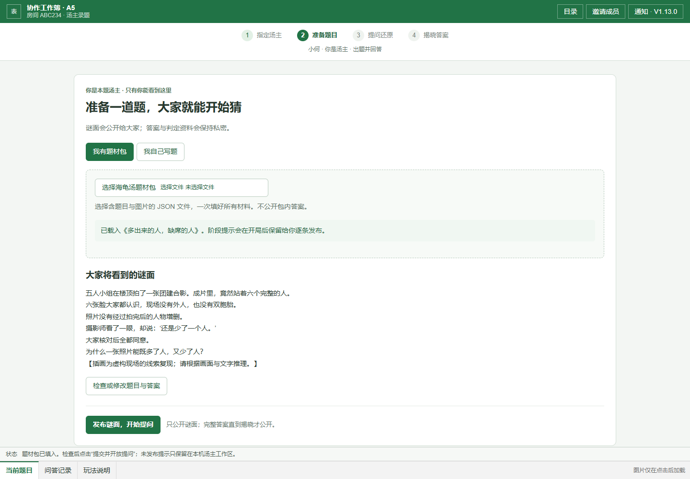
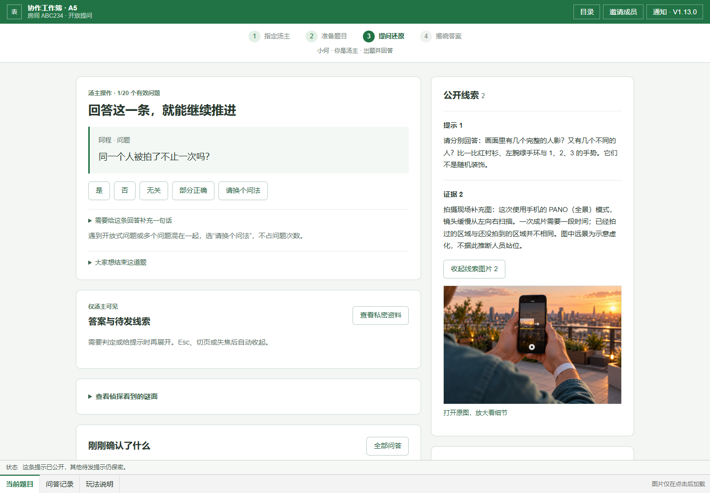
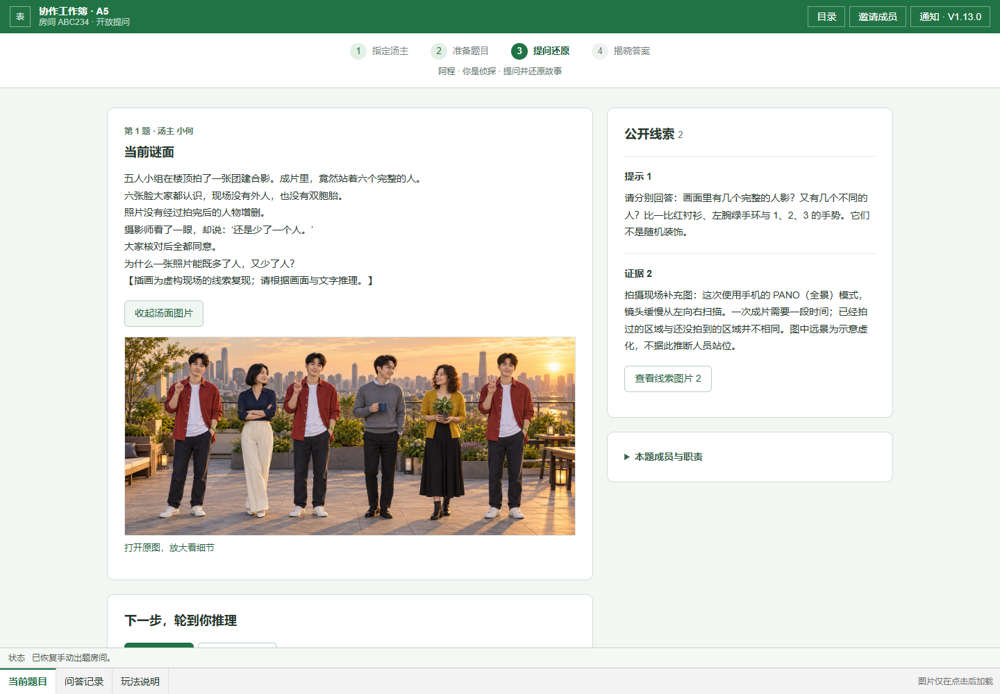
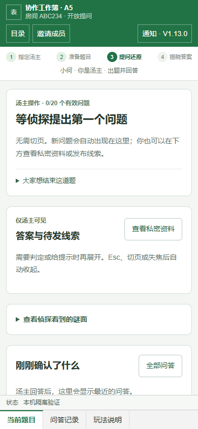

# A5 V1.13：指定汤主与分步游玩

2026-09-30。面向第一次打开 A5 的成员，页面直接回答三个问题：我是谁、现在在做什么、下一步点哪里。

## 游玩流程

1. **进房与选汤主**：入口分为“我有房间编号”和“我来组织一局”。至少两人加入后，负责人必须在“本题汤主”中选择一名成员才能开始，没有默认人选或随机分配。选择知道答案、准备出题的人；其余成员无需备题。
2. **准备题目**：指定汤主看到“我有题材包 / 我自己写题”。导入后先看到将公开的谜面，答案编辑和判定资料按需展开。点击“发布谜面，开始提问”后，其他人的等待页自动变成题目页。
3. **提问与还原**：侦探在谜面下使用同一提交区，切换“提一个问题 / 我想提交答案”，两份草稿分别保留。提交后显示自己的待答内容和队列位置。汤主直接看到队首与判定按钮，答案和待发提示默认隐藏；已公开线索与最近问答始终可查。
4. **揭晓与下一题**：还原成功或主动揭晓后直接显示完整故事，可展开结局图。负责人再次明确选择汤主，可连续指定同一人。下一题的旧谜面、答案、队列和私密预览均清空。

只保留“当前题目 / 问答记录 / 玩法说明”三个页签。次数、补充说明、额外线索、成员职责和结束房间等次要内容按需展开。手机改为单列，标题栏按钮不挤断，无横向大表格。

## 页面预览

以下为真实 React 组件、五人本地模拟房间的截图，不代表线上已经部署。

## 发布顺序

前置环境已完成 A5 V10、V10.1、V12、V12.1；图片沿用 V12.2 私有存储。

1. 执行 [指定汤主增量 SQL](../cloudbase/concurrency-v13-soup-designated-host.sql)。只新增函数，不删除旧表、旧接口或房间。
2. 执行 [只读核验 SQL](../cloudbase/verify-v13-soup-designated-host.sql)，确认 **7 行均 `ok=true`**。
3. 发布本版前端。当前调用 `apply_soup_action_v13`；漏迁移会提示先完成 V13，不会回退为随机分配。
4. 发布后让所有成员刷新页面。旧前端仍使用旧随机接口，不能用旧标签页验收新规则。

本轮未执行真实云端 SQL、未触发站点部署。若需要回退，仅回退前端到之前版本即可；保留 V13 新增函数无需删库。回退后的旧客户端仍按旧随机规则运行。

## 验证结果与边界

- `npm test`：148 项通过；含实际 PGlite SQL 测试，验证指定非房主、连续同一汤主、换人、私密读取隔离、失效状态、重复请求及非法选择拒绝。V13 脚本重复执行通过，7 项只读核验通过。
- `npm run lint` 与 `npm run build` 通过；生产构建包含 TypeScript 检查，六个路由均生成静态产物。
- Edge headless：16 项实际 React 流程检查通过。覆盖首次入口、指定非房主、其他成员等待、三图导入、队首判定、刷新恢复阶段提示、Esc/失焦隐藏私密图、双草稿切换、过期响应保留输入、队列状态、揭晓、下一题同汤主、手动录题及 390px 手机无横向溢出。无浏览器运行时异常，结果见 [本地流程记录](soup-v13/browser-checks.json)。
- 截图经目视检查；浏览器流程使用本地云接口替身，服务端行为另由 SQL 测试覆盖，未连接真实 CloudBase。发布后仍需用两个独立浏览器账号检查实时同步、权限及真实图片上传。
- 题材包的待发提示只在汤主原标签页缓存，换设备不保证恢复；签名图片链接仍为 24 小时。题目趣味性仍待真人盲测。

## 发布后最短验收

两名成员分别建房/加入。负责人指定另一人，确认负责人只有等待页、对方有录题页；对方出题，负责人提问，汤主回答并揭晓；负责人下一题再选同一人。然后导入图片题材包确认汤面可见、待发线索与答案在揭晓前不会出现在侦探端。
